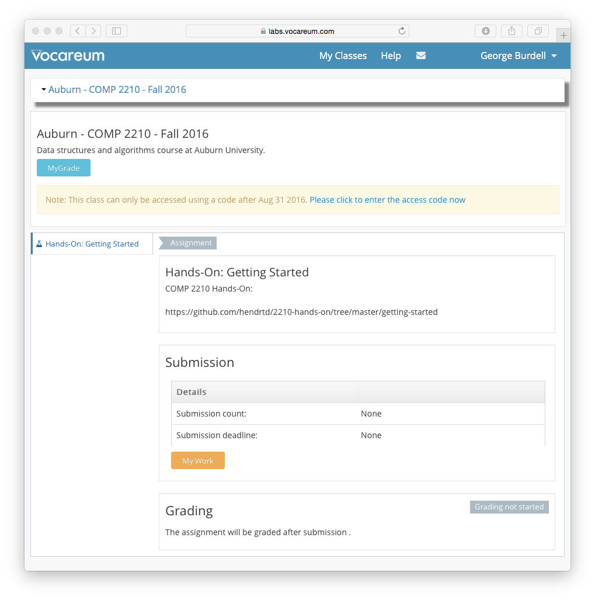

<!---
	Description file for COMP 2210 Hands-On: Getting Started.
	Introduces basic requirements and procedures for lab.

	@author:  Dean Hendrix <dh@auburn.edu>
	@version: 2016-08-16
-->

# Hands-On: Getting Started

You are asked to perform several activities that will help you prepare for the COMP 2210 assignments. Although this is ungraded, you are strongly encouraged to complete each task. Be sure to ask your TA questions if you have trouble.

## Canvas

Nagivate within Canvas and familiarize yourself with the organization of the course and the materials that are provided. In particular, be sure to:

1. Read the official course syllabus.
1. Register and log in to Piazza.
1. Make sure you can find all the course notes.
1. Make sure your Canvas account Notification Preferences are what you want. At a minimum, you are required to have all course announcements sent to your TigerMail immediately.

## Directory Structure

Use of the Engineering network drive is not required, but it is strongly encouraged. If you store all your work on the Engineering drive, you will always have your files backed up and available anywhere, anytime.

1. Open your Engineering H: drive.
2. Create a folder named `COMP2210`.
3. Open `COMP2210` and create the following subdirectories, plus any others you may want.
	- `hands-on`
	- `assignments`
	- `notes`
	- `tools`
4. Repeat the steps above on your own machine if you will be using it for completing work in this course.
	- I would also recommend using a free backup and synchronization service like Dropbox (`dropbox.com`). You **never** want to be in the situation of losing all the work you've put in on an assignment.
	- If you want to get a head start on using a professional tool for backup, synchronization, and more, then you could explore the use of `git` (see `https://git-scm.com/`). This carries a steep learning curve and isn't necessary for 2210 so ... *caveat discipulus*.
		- If you use `git` you may also want to use a web-based code hosting service like GitHub. I support the use of hosting services, but all assignment-related code must be kept strictly in **private** repositories during the semester. Although GitHub offers free private repos, there are hoops to jump through. I would recommend either GitLab or Bitbucket for relatively painless and free private repos.
5. If you will be using your own computer or other off-campus computers to complete course work, refer to the following link to see how to keep your local files in sync with the Engineering drive.
	- [`http://eng.auburn.edu/admin/ens/helpdesk/off-campus/index.html`](http://eng.auburn.edu/admin/ens/helpdesk/off-campus/index.html)

## jGRASP

1. If you are working on your own computer, download and install the latest version of jGRASP from [jgrasp.org](http://jgrasp.org).
1. Launch jGRASP.
1. Use the *Settings* menu to configure the following features, and others if desired.
	- *Auto Update*: Select *Check for New Versions* -> *Automatically Check*. If this option is checked, jGRASP checks for a new version once per day and gives you the opportunity to install the new version immediately.
	- *Auto Save*: If this option is checked, modified files are saved before a compile operation.
	- *Auto Compile*: If this option is checked, files and projects will be compiled before a run or debug operation.
	- *CSD Window Settings > Auto Generate CSD*: If this option is checked, a CSD is generated automatically when a file is loaded, edited, compiled, etc.
	- *Look And Feel*: This option allows you to select an overall look-and-feel for the windows, menus, etc.
1. Use the *Tools* menu to configure the **JUnit plugin**.
	- *Note: The Engineering lab machines have JUnit already installed and jGRASP will by default have this plugin configured. For your own machine, you will have to download and unzip JUnit first and then configure this plugin with the steps below.*
	- Create the following directory: `COMP2210/tools/junit`.
	- Download to the directory you just created the two jar files (`junit.jar` and `hamcrest-core.jar`) from the latest stable release of JUnit (4.12) available at the following URL.
		- [`https://github.com/junit-team/junit/wiki/Download-and-Install`](https://github.com/junit-team/junit/wiki/Download-and-Install)
	- Select *Tools > JUnit > Configure*.
	- Set "JUnit Home" to the `COMP2210/tools/junit/` directory.
	- Click *Ok*.
1. Use the *Tools* menu to configure the **Checkstyle plugin**.
	- *Note: The Engineering lab machines have Checkstyle already installed and jGRASP will by default have this plugin configured. For your own machine, you will have to download and unzip Checkstyle first and then configure this plugin with the steps below. Also, you will have to configure the lab machines to use the correct checks file below.*
	- Create the following directory: `COMP2210/tools/checkstyle`.
	- Download to the directory you just created the jar file `checkstyle-7.1-all.jar` from the latest stable release of Checkstyle (7.1) available at the following URL.
		- [`http://sourceforge.net/projects/checkstyle/files/checkstyle/`](http://sourceforge.net/projects/checkstyle/files/checkstyle/)
	- Download the XML file below and save it in the `checkstyle` directory you created.
		- [`2210.google_checks.xml`](https://raw.githubusercontent.com/hendrtd/comp2210/master/coding_style_guidelines/2210.google_checks.xml)
	- Select *Tools > Checkstyle > Configure*.
	- Set "Checkstyle Home" to the `COMP2210/tools/checkstyle/` directory.
	- Set "Checks File" to the `2210.google_checks.xml` file.
	- Click *Ok*.
	- Note that the XML checks file that we're using is a slightly modified version of the Checkstyle checks for the Java coding style conventions published by Google.
	- You should read through the style documentation here:
		- [`http://google.github.io/styleguide/javaguide.html`](http://google.github.io/styleguide/javaguide.html)

## Access the provided source code

1. Open the `hands-on` directory and create a subdirectory named `getting-started`.
1. Download the following file to the `COMP2210/hands-on/getting-started/` directory you created. The easiest way to download the file will be to click on the hyperlink below, then click on the *Raw* button to load a plain-text version in the browser window, and then right-click in the window and choose the *Save as ...* option. Make sure you save it as `WarEagle.java`.
	- [`WarEagle.java`](src/WarEagle.java)

## Vocareum

1. Read the following help page for an overview of logging in to and using Vocareum: [http://help.vocareum.com/article/30-getting-started-students](http://help.vocareum.com/article/30-getting-started-students).
1. Login to Vocareum at [labs.vocareum.com](https://labs.vocareum.com). You should see a page similar to the following:
	
1. **You must enter a valid access code before the grace period ends.** Access cards can be purchsed in the AU Bookstore for $20.
1. Click on *Hands-On: Getting Started* in the left menu.
1. Click on *My Work*.
1. Click on *Upload* in the left pane of the workbench and follow the instructions to upload the `WarEagle.java` file.
1. Click *Submit*.
1. View the Submission Report in the terminal window at the bottom of the workbench.
	- The submission report is simply the output of compiling, running a checkstyle audit, and executing JUnit tests. It is exactly what you would see at the command line if you were doing this yourself.
	- The submission report doesn't record a grade. Grading only occurs once the submission deadline is passed.

## jGRASP

1. Open the `WarEagle.java` file in an editor window.
1. Compile and run the file.
1. Make a few changes in the file to embed some intentional errors, including coding style issues.
1. Resubmit this file in Vocareum.
1. Correct the errors you introduced and resubmit.
1. Repeat the last few steps until you become comfortable with the workflow that you will use to submit your work to Vocareum for this course.

## Directory Structure

Make sure your H: drive, your local files, and your Dropbox (or whatever) files are all in sync. **Get in the habit of making this the last step in all your 2210 work sessions.**

